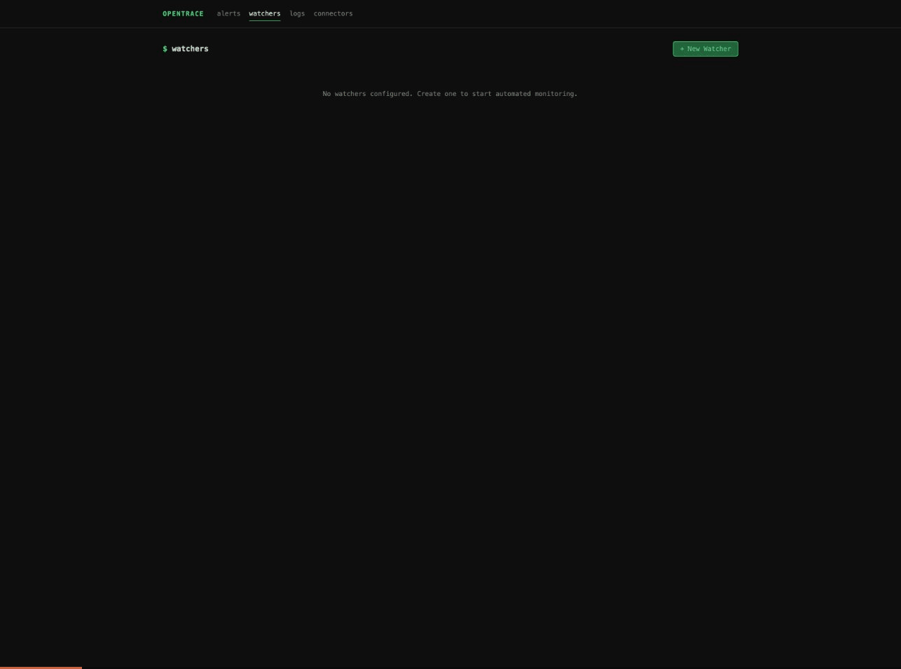
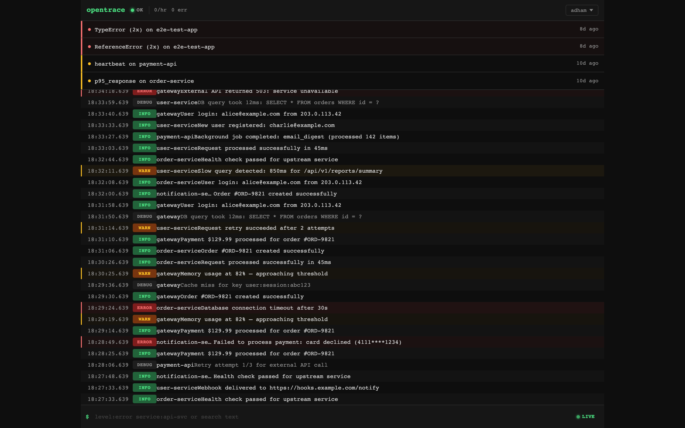
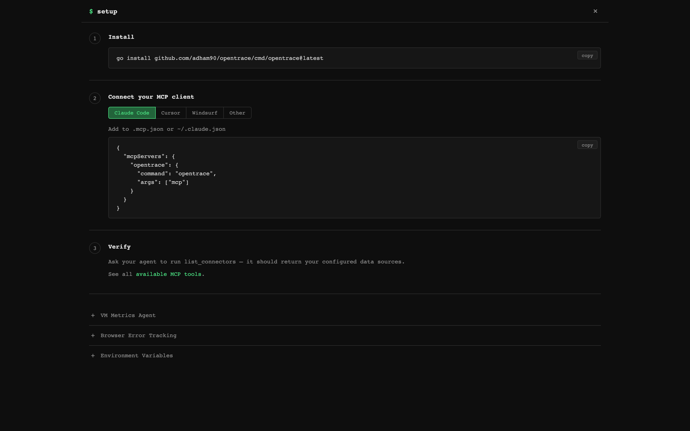
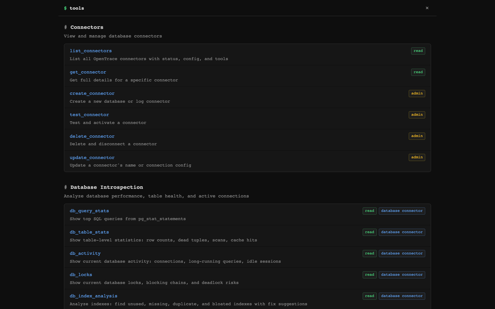

<p align="center">
  
</p>

<h3 align="center">Give your AI assistant eyes into production</h3>

<p align="center">
  Self-hosted observability server with 75+ MCP tools.<br/>
  Ingest logs, connect Postgres, monitor servers — then debug it all from Claude, Cursor, or any MCP client.
</p>

<p align="center">
  <a href="https://github.com/adham90/opentrace/releases"></a>
  <a href="https://github.com/adham90/opentrace/actions/workflows/ci.yml"></a>
  <a href="https://github.com/adham90/opentrace/blob/main/LICENSE"></a>
  <a href="https://pkg.go.dev/github.com/adham90/opentrace"></a>
  <a href="https://ghcr.io/adham90/opentrace"></a>
</p>

<p align="center">
  <a href="#quick-start">Quick Start</a> &middot;
  <a href="#mcp-tools">MCP Tools</a> &middot;
  <a href="#features">Features</a> &middot;
  <a href="#deploy">Deploy</a> &middot;
  <a href="docs/">Docs</a>
</p>

---

## Why OpenTrace?

Your AI coding assistant can read your code — but it's blind to what's happening in production. OpenTrace fixes that.

- **No more copy-pasting** stack traces, log snippets, or query plans into chat
- **No cloud vendor required** — single binary, SQLite storage, runs anywhere
- **MCP-native** — not an afterthought API wrapper; every feature is designed as an MCP tool with guided workflows
- **Your data stays yours** — fully self-hosted, no telemetry, no external calls

## Quick Start

**Docker (fastest):**

```bash
docker run -d --name opentrace -p 8080:8080 -v opentrace-data:/data ghcr.io/adham90/opentrace:latest
```

**From source:**

```bash
git clone https://github.com/adham90/opentrace.git && cd opentrace
cp .env.example .env
go build -o opentrace ./cmd/opentrace && ./opentrace
```

Open [localhost:8080](http://localhost:8080) — first visit triggers admin setup.

**Then connect it to your AI assistant:**

```json
// .mcp.json (Claude Code) or claude_desktop_config.json (Claude Desktop)
{
  "mcpServers": {
    "opentrace": {
      "type": "stdio",
      "command": "/path/to/opentrace",
      "args": ["mcp"]
    }
  }
}
```

Now ask your assistant: *"What errors are happening in production?"*

## MCP Tools

OpenTrace exposes **75+ tools** over MCP (stdio + SSE). The server sends guided instructions at handshake time and returns `suggested_tools` with pre-filled arguments, so your AI assistant knows what to call next.

### Overview & Triage

| Tool | What it does |
|---|---|
| `diagnose` | One-call health check: errors, logs, performance, watches, and health checks |
| `system_overview` | High-level system health dashboard |
| `triage_alerts` | Prioritized inbox of items needing attention |
| `runbook` | Composite playbooks for slow_database, error_spike, disk_pressure, etc. |

### Log Intelligence

| Tool | What it does |
|---|---|
| `log_search` | Full-text search with filters: service, level, env, trace ID, exception class, metadata |
| `log_context` | Surrounding log entries around a specific log |
| `log_summary` | Error rates, active deploys, top errors with file:line, slowest endpoints |
| `trace_lookup` | Assemble a distributed trace from log entries |
| `request_performance` | N+1 query detection, slowest endpoints, SQL-heavy requests |
| `compare_periods` | Period-over-period comparison of error rates and log volume |

### Database Introspection (Postgres)

| Tool | What it does |
|---|---|
| `db_query_stats` | Top queries from pg_stat_statements by time/calls/rows |
| `db_table_stats` | Row counts, dead tuples, cache hit ratios, vacuum status |
| `db_activity` | Active connections, long-running queries, idle-in-transaction |
| `db_locks` | Lock contention chains and blocking queries |
| `db_index_analysis` | Unused, missing, duplicate, bloated indexes with CREATE/DROP suggestions |
| `explain_query` | EXPLAIN ANALYZE with optimization tips |
| `bloat_estimate` | Table and index bloat with reclaimable space |
| `replication_status` | Replica lag, slot status, WAL archival |

### Errors (Sentry-like)

| Tool | What it does |
|---|---|
| `error_groups` | Errors grouped by fingerprint with occurrence counts |
| `investigate_error` | Deep dive: backtrace, cause chain, request params, SQL queries, surrounding logs |
| `error_impact` | How many users hit each error, affected user lists, impact scores |

### Analytics & Journeys

| Tool | What it does |
|---|---|
| `trends` | Time-series for error rate, p95 response, request volume with deploy markers |
| `user_journey` | Reconstruct a user's request sequence in a session |
| `funnel_analysis` | Define and measure conversion funnels |
| `incident_timeline` | Chronological merge of errors, alerts, health check changes |

<details>
<summary><strong>See all 75+ tools</strong></summary>

**Uptime:** `list_healthchecks`, `uptime_status`, `create_healthcheck`, `delete_healthcheck`

**Watches:** `watch_status`, `watch` (create threshold alerts), `investigate`, `dismiss_watch`

**Server Metrics:** `list_servers`, `query_metrics`, `server_health`

**Connectors:** `list_connectors`, `get_connector`, `create_connector`, `test_connector`, `update_connector`, `delete_connector`

**More Database:** `schema_overview`, `vacuum_report`, `disk_usage`, `pg_config_check`, `checkpoint_stats`, `sequence_health`, `long_transactions`, `connection_pool_stats`, `kill_query`, `db_search` (per-connector)

**More Analytics:** `top_movers`, `web_analytics`, `top_endpoints`, `traffic_heatmap`, `path_analysis`, `request_timeline`, `session_waterfall`

**More Logs:** `log_stats`, `list_log_attributes`, `log_context`

**Agent Memory:** `get_notes`, `add_note`, `delete_note` — persistent notes across sessions

**Settings:** `get_settings`, `update_retention`, `list_users`, `get_audit_log`

</details>

### Guided Workflows

Tools return `suggested_tools` with pre-filled arguments, chaining naturally:

```
diagnose → error_detail → log_search (with exception_class pre-filled)
                        → trace_lookup (with trace_id pre-filled)

db_query_stats → explain_query (with slowest query pre-filled)

triage_alerts → investigate → log_search (with service + error level)
```

Your AI assistant follows these suggestions automatically — no prompt engineering needed.

See the full [MCP integration guide](docs/mcp-integration.md) for setup instructions and complete tool reference.

## Features

### Dashboard — Live Logs & Alerts

Real-time log stream with attention zone showing active alerts. Click any log entry to expand details. Filter by level, service, or free-text search.



### MCP Setup — Connect in 3 Steps

Built-in setup page with copy-paste configs for Claude Code, Cursor, Windsurf, and any MCP client. Includes a one-line install command.



### 75+ MCP Tools — Organized by Category

Every tool is browsable in the web UI with descriptions, access levels, and connector requirements.



### Log Ingestion

Ingest structured logs via HTTP, search with SQLite FTS5. Filter by service, level, environment, trace ID, commit hash, exception class, or any metadata field.

```bash
curl -X POST http://localhost:8080/api/logs \
  -H "Content-Type: application/json" \
  -H "Authorization: Bearer YOUR_API_KEY" \
  -d '{
    "service": "payment-api",
    "level": "error",
    "message": "Payment gateway timeout after 30s",
    "environment": "production",
    "event_type": "payment.failed",
    "metadata": {"transaction_id": "tx_abc123"}
  }'
```

A [Ruby gem](https://github.com/adham90/opentrace_ruby) is available for Rails apps — auto-captures request summaries, SQL counts, N+1 queries, cache hit rates, and ActiveJob events.

### Postgres Connector

Connect read-only to your production Postgres databases. All queries are validated SELECT-only via SQL AST parsing, with configurable timeouts and row limits. Introspection tools read from `pg_stat_*` views — no application changes needed.

### Rule-Based Watches

Threshold monitors on log-derived metrics: `error_rate`, `error_count`, `response_time`, `p95_response`, `sql_count`, `cache_hit_rate`, `heartbeat`, `log_count`. Supports cron schedules, consecutive-breach requirements, and auto-resolve when metrics return to baseline.

### Server Monitoring

Lightweight agent (`opentrace agent`) collects CPU, memory, disk, network, and load metrics via gopsutil and pushes to the dashboard. [Agent docs](docs/vm-agent.md).

## Deploy

### One-Click

| Platform | | Notes |
|---|---|---|
| **DigitalOcean** | [](https://cloud.digitalocean.com/apps/new?repo=https://github.com/adham90/opentrace/tree/main) | ~$5/mo |
| **Railway** | [](https://railway.com/new/template?template=https://github.com/adham90/opentrace) | Free tier |
| **Render** | [](https://render.com/deploy?repo=https://github.com/adham90/opentrace) | Free tier |

### Docker Compose

```bash
# Development
docker compose up -d

# Production (with auto-updates via Watchtower)
docker compose -f docker-compose.prod.yml up -d
```

### Binary

Download from [GitHub Releases](https://github.com/adham90/opentrace/releases):

```bash
curl -L https://github.com/adham90/opentrace/releases/latest/download/opentrace_linux_amd64.tar.gz | tar xz
./opentrace
```

### Fly.io

```bash
fly launch --copy-config --no-deploy
fly deploy
```

<details>
<summary><strong>More deployment options</strong></summary>

**Hetzner:** `./deploy/deploy.sh` — full VPS with Caddy + automated backups (~$4/mo)

**Systemd:**
```ini
[Unit]
Description=OpenTrace
After=network.target

[Service]
Type=simple
ExecStart=/opt/opentrace/opentrace
EnvironmentFile=/opt/opentrace/.env
Restart=always

[Install]
WantedBy=multi-user.target
```

**Data storage:** Everything lives in a single SQLite file at `~/.opentrace/opentrace.db` (override with `OPENTRACE_DATA_DIR`). WAL mode for concurrent reads. Back up this one file.

**Auto-updates:** The production Docker Compose includes Watchtower. For binary installs, the dashboard shows a banner when a new version is available.

See the full [deployment guide](docs/deployment.md) for all options including Hetzner, systemd, TLS, and configuration reference.

</details>

## Configuration

All configuration via environment variables (`.env` file):

| Variable | Default | Description |
|---|---|---|
| `OPENTRACE_LISTEN_ADDR` | `:8080` | HTTP listen address |
| `OPENTRACE_DATA_DIR` | `~/.opentrace` | SQLite database directory |
| `OPENTRACE_API_KEY` | _(empty)_ | Bearer token for log ingestion |
| `OPENTRACE_MAX_QUERY_ROWS` | `500` | Max rows from SQL queries |
| `OPENTRACE_STATEMENT_TIMEOUT_MS` | `5000` | SQL query timeout (ms) |
| `OPENTRACE_MCP_TOKEN` | _(empty)_ | Token for MCP SSE transport |

See [`.env.example`](.env.example) for the full list including TLS, CORS, retention, and proxy settings.

## Architecture

```
                         ┌────────────────────────────┐
  ┌──────────┐           │       Web UI (HTMX)        │         ┌────────────┐
  │ VM Agent │──metrics─▶│  Alerts │ Logs │ Watches    │◀─browse─│  You / CI  │
  └──────────┘           └────────────┬───────────────┘         └────────────┘
                                      │
  ┌──────────┐           ┌────────────▼───────────────┐         ┌────────────┐
  │ Your App │──logs────▶│     HTTP Server (Chi)       │◀─stdio─│Claude/MCP  │
  └──────────┘           │    REST API + MCP Server    │        │  Client    │
                         └────────────┬───────────────┘         └────────────┘
                                      │
             ┌────────────────────────┼────────────────────────┐
             │                        │                        │
   ┌─────────▼──────────┐  ┌─────────▼────────┐    ┌──────────▼─────────┐
   │  Connector Layer    │  │  Watch Engine     │    │  Postgres          │
   │  Logs + DB + Metrics│  │  Threshold Alerts │    │  (your databases)  │
   └─────────┬──────────┘  └─────────┬────────┘    └────────────────────┘
             │                        │
             └────────────┬───────────┘
                          │
           ┌──────────────▼───────────────────┐
           │       SQLite (WAL + FTS5)         │
           │  Logs │ Errors │ Watches │ Alerts │
           │  Metrics │ Sessions │ Journeys    │
           └──────────────────────────────────┘
```

**Design decisions:**
- **SQLite** — Zero dependencies. Single-file database with FTS5 for full-text log search.
- **MCP-first** — Every feature is an MCP tool, not just a REST endpoint. Tools include guided suggestions so AI assistants navigate workflows without prompt engineering.
- **Read-only DB access** — Queries against your Postgres are validated SELECT-only via SQL AST parsing.
- **Single binary** — Web server, MCP server, and VM agent in one binary. No runtime dependencies.

## Documentation

| Doc | Description |
|---|---|
| [MCP Integration](docs/mcp-integration.md) | Setup for Claude Code, Cursor, Windsurf + full tool reference |
| [API Reference](docs/api-reference.md) | REST API endpoints, log fields, watch scheduling |
| [Deployment Guide](docs/deployment.md) | Docker, cloud platforms, systemd, configuration |
| [VM Agent](docs/vm-agent.md) | Server metrics agent setup and systemd service |

## Development

```bash
go test -short -race ./...              # unit tests (no Docker)
go test -race ./...                     # full suite (needs Docker for Postgres)
OPENTRACE_DEV=true ./opentrace          # live template reload
```

See [CONTRIBUTING.md](CONTRIBUTING.md) for development setup and guidelines.

## License

[MIT](LICENSE)
